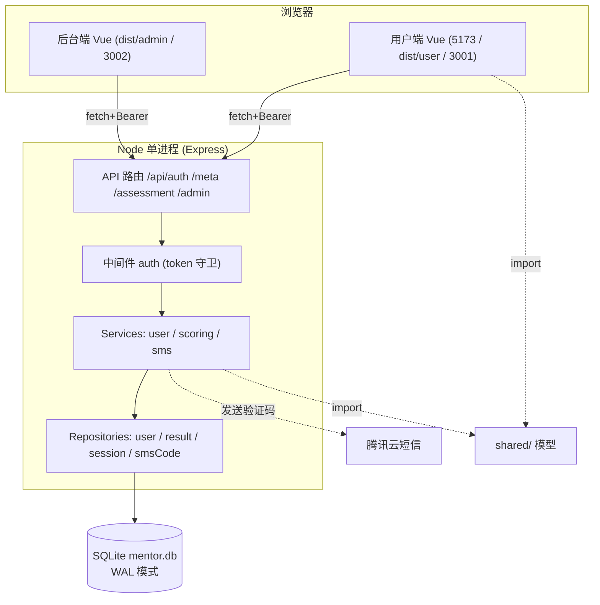

# 导师辅导能力成熟度自评

一个「登录 → 答题 → 可视化报告 + 建议」的导师辅导能力测评系统，模仿职场基因检测类测评产品的交互形态。

- 前端：**Vue 3 + Vite + Pinia + Vue Router + ECharts（雷达图）**
- 后端：**Node.js (Express) + 内置 `node:sqlite`**（零原生编译依赖，需 Node ≥ 22.5）**
- 能力模型：**12 个维度 × 81 道李克特量表题（1–5 分），4 档成熟度等级（CMMI 风格）**
- 附加：**管理看板**（团队整体成熟度、各维度均值、等级分布、用户与测评记录）

> 本文档为总文档，已整合原 `ROPECT-Mentor001.md`（架构与代码详解）于此。

## 目录结构与各文件职责

### 顶层

| 文件 / 目录 | 职责 |
|---|---|
| `package.json` | 前端依赖 + 一键脚本（`dev` 同时起前后端、`build:all` 构建用户端+后台端） |
| `vite.config.js` | 用户端（测评端）Vite 配置：开发端口 5173，前端通过 proxy 把 `/api` 转发到后端 3001；`build.outDir: dist/user` |
| `vite.admin.config.js` | 后台管理端独立 Vite 配置：`root: src/admin`，产物输出 `dist/admin`，由后端 3002 端口托管 |
| `index.html` | 用户端 HTML 入口，`<script>` 加载 `src/main.js` |
| `README.md` | 本文档（全栈项目说明总文档） |

### `shared/` —— 前后端共用的数据模型（核心：改这里就能调整测评内容）

| 文件 | 职责 |
|---|---|
| `dimensions.js` | 12 个能力维度定义（id / 名称 / 配色 / 描述）+ `dimensionMap` |
| `questions.js` | 81 道自评题，每题归属某维度，5 级量表 |
| `levels.js` | 4 档成熟度等级（分数区间 + 描述）+ `getLevel(score)` 映射函数 |
| `suggestions.js` | 各维度按低/中/高三档的改进建议 + `getSuggestion(dimId, avg)` |

> 后端 `scoring.service.js`、`meta` 路由、前端 `AssessmentView`/`ResultView` 都直接 `import` 这些文件，实现**前后端模型自动同步**。

### `server/` —— 后端（Express + SQLite）

```
server/
├── package.json        # 后端依赖（express / cors / tencentcloud-sdk-nodejs-sms）
├── start.sh            # 启动脚本：探测 Node 22/24 选择 node:sqlite 参数，读取根目录 .env
├── src/
│   ├── index.js        # 入口：建两个 app，分别监听 3001（用户端）/ 3002（后台端），托管 dist
│   ├── db.js           # 建库建表（users/sessions/results/sms_codes）、WAL 配置、种子管理员
│   ├── crypto-hash.js  # 密码哈希（scrypt + 随机 salt + 定时比较防时序攻击）
│   ├── middleware/auth.js   # 鉴权中间件：createSession/destroySession + requireAuth/requireAdmin 守卫
│   ├── routes/         # 路由层（薄层，只收参/校验/调服务）
│   │   ├── auth.js     # 注册/登录/短信验证码/找回密码/登出/me
│   │   ├── meta.js     # GET /api/meta 公开返回维度/题目/等级
│   │   ├── assessment.js  # 提交测评计分、历史、详情
│   │   └── admin.js    # 团队概览/用户列表/全部测评记录（需管理员）
│   ├── services/       # 业务逻辑层
│   │   ├── user.service.js  # 注册/登录/验证码发送与消费业务流程、手机号校验、限频
│   │   ├── scoring.service.js  # 由 answers 计算各维度分/总分/等级
│   │   └── sms.service.js   # 腾讯云短信发送 + 错误码→中文翻译
│   └── repositories/   # 数据访问层（仅 SQL，无业务规则）
│       ├── user.repo.js    # users 表 CRUD + 统计
│       ├── result.repo.js  # results 表增查 + 管理聚合统计
│       ├── session.repo.js # sessions 表
│       └── smsCode.repo.js # sms_codes 表
└── data/               # SQLite 文件目录（mentor.db，WAL 模式）
```

**后端分层架构**（经典三层）：`routes`（薄）→ `services`（业务）→ `repositories`（数据）→ `db`。

### `src/` —— 用户端前端（Vue 3）

```
src/
├── main.js             # 应用入口：挂载 Pinia + Router
├── App.vue             # 根组件
├── router/index.js     # 用户端路由 + 全局守卫（未登录跳登录/非管理员禁入后台）
├── api/client.js       # 统一 API 客户端：自动带 token、统一错误处理
├── stores/             # Pinia 状态
│   ├── user.js         # 登录态（token/user/role），isLoggedIn/isAdmin
│   └── assessment.js   # 答题进度（81 题平铺）、提交测评
├── utils/              # token.js(localStorage 读写) / validate.js / format.js
├── views/              # 页面
│   ├── IntroView.vue           # 测评引导页
│   ├── AssessmentView.vue      # 答题页（单题平铺、自动翻页、进度条）
│   ├── ResultView.vue          # 结果页（雷达图 + 等级 + 维度条 + 建议）
│   ├── AdminView.vue           # 管理员入口（前端路由可进，真正后台在 src/admin）
│   ├── auth/                   # 登录/注册/找回密码
│   └── completion/            # 提交完成页
├── components/         # QuestionCard / StepProgress / RadarChart(ECharts) / DimensionBar / SuggestionCard
├── styles/             # 全局样式 main.css
└── admin/              # 独立后台管理前端（用户端同源，但单独构建到 dist/admin）
    ├── index.html / main.js / AdminApp.vue / router.js
    └── views/          # AdminLoginView / AdminView（团队概览/各维度均值/等级分布/用户与记录）
```

### `deploy/` —— 运维部署脚本

| 文件 | 职责 |
|---|---|
| `setup-server.sh` | 一键部署：拉代码→装依赖→构建→生成 `.env`(密码不进仓库)→建低权限账户→注册 systemd→放行端口→健康检查 |
| `update.sh` | 日常更新：`git pull`→装依赖→构建→`systemctl restart`→健康检查 |
| `mentor-ability.service` | systemd 单元：`Restart=always`、低权限 `mentor` 用户、`MemoryMax=768M`、日志交 journald |
| `mentor-watchdog.sh` | 看门狗：每分钟探 `/api/health`，不通则重启（补足 systemd 仅在进程退出时重启的盲区） |
| `fix-3002.sh` | 诊断/修复 3002 端口 502（修正 nginx 的 `proxy_pass` 指向 `127.0.0.1:3002`） |
| `nginx-mentor.conf` | 可选的 Nginx 反代片段（独立 server 块，接域名/HTTPS 用，不改动旧站点配置） |

## 本地开发

要求 Node.js ≥ 22.5（用到内置 `node:sqlite` 与 `--env-file`）。

```bash
# 1. 安装依赖（前端 + 后端）
npm run install:all
# 或分别： npm install   &&   npm --prefix server install

# 2. 同时启动前后端（前端 5173，后端 3001）
npm run dev
```

打开 http://localhost:5173 即可。默认管理员账号见 `.env`（`admin / admin123`）。

> 说明：开发时前端通过 Vite 代理把 `/api` 转发到后端 3001；生产构建后由后端直接托管 `dist`。

## 生产构建与运行

```bash
npm run build          # 生成 dist/
# 让后端托管 dist 并读取 .env
SERVE_DIST=true npm run server
```

此时访问 `http://localhost:3001` 即为完整应用（前后端同源）。

## 部署到腾讯云（与「职场基因检测」旧站点共存，且互不影响）

> ### 你的两点硬性要求（本方案已满足）
> 1. **绝不改动旧网站**：旧站点是 Docker 栈（docker compose 管理，PostgreSQL 在 docker 卷 `pgdata`），
>    本工具**完全不进 Docker、不碰旧站点的任何配置文件/数据库**，旧站点的 `deploy.sh` 永远碰不到它。
> 2. **同服务器共存**：两个应用只是共用同一台 Ubuntu 操作系统，代码目录、进程、端口、数据库文件全部独立。

### 隔离对照表

| 维度 | 旧站点（职场基因检测） | 本工具（导师辅导自评） |
|---|---|---|
| 代码目录 | 旧仓库目录 / Docker 卷 | `/opt/mentor-ability`（新建，独立） |
| 运行方式 | Docker 容器（docker compose） | **独立 systemd 服务** `mentor-ability` |
| 监听端口 | `8080` / `8081`（nginx 反代到内网 `3000`） | `3001`（独立） |
| 数据库 | PostgreSQL（docker 卷 `pgdata`） | `server/data/mentor.db`（**独立 SQLite 文件**） |
| 部署入口 | 旧仓库 `deploy.sh` | 本工具的 systemd 服务（互不调用） |

二者唯一共享的是操作系统与防火墙；本工具仅**新增**一条 `3001` 入站规则，不动旧站点的 `8080/8081`。

### 逐步操作手册（在服务器 `124.221.158.216` 上执行）

```bash
# ── 0. 前置：确认 Node 版本（服务器已装 Node 22；本工具用内置 node:sqlite）──
node -v        # 需 >= 22.5；start.sh 会自动兼容 22（加 --experimental-sqlite）与 24+

# ── 1. 建独立目录（不碰旧站点任何目录）──
sudo mkdir -p /opt/mentor-ability
sudo chown -R $USER:$USER /opt/mentor-ability

# ── 2. 传代码（用 Git 拉取，或本地 scp/rsync；不要包含 node_modules / .git / dist）──
#   方式 A（推荐）：在服务器上直接拉取本仓库
#     git clone <你的仓库地址> /opt/mentor-ability
#   方式 B：本地把项目传上去（排除大目录）
#     rsync -av --exclude node_modules --exclude dist --exclude .git \
#       ./ d:/app/code/code/mentor-ability001/ 用户@124.221.158.216:/opt/mentor-ability/
cd /opt/mentor-ability

# ── 3. 装依赖 + 构建前端 dist（dist 由后端直接托管）──
npm install && npm --prefix server install
npm run build

# ── 4. 生成生产 .env（复制模板并改密码/密钥；模板已提交，不会带真实密钥）──
cp .env.production .env
# 用编辑器把 .env 里的 ADMIN_PASSWORD、AUTH_SECRET 改成你自己的值：
#   AUTH_SECRET 生成： openssl rand -hex 32
nano .env

# ── 5. 给启动脚本加可执行权限 ──
chmod +x server/start.sh

# ── 6. 建独立低权限账户运行（进一步隔离，可选但推荐）──
sudo useradd -r -s /usr/sbin/nologin -d /opt/mentor-ability mentor
sudo chown -R mentor:mentor /opt/mentor-ability

# ── 7. 注册并启动 systemd 服务（开机自启 + 崩溃自动重启）──
sudo cp deploy/mentor-ability.service /etc/systemd/system/
sudo systemctl daemon-reload
sudo systemctl enable --now mentor-ability

# ── 8. 放行端口（仅“新增”规则，不动旧站点 8080/8081）──
#    a) 腾讯云控制台 → 防火墙/安全组 → 入站规则 → 新增 TCP:3001
#    b) 若系统开了 ufw： sudo ufw allow 3001

# ── 9. 验证 ──
curl http://localhost:3001/api/health     # 返回 {"ok":true,...} 即成功
sudo systemctl status mentor-ability       # 确认 Active: active (running)
journalctl -u mentor-ability -n 50         # 看日志
```

启动成功后，用户即可访问：**http://124.221.158.216:3001/**
管理后台登录用 `.env` 里设置的 `ADMIN_USERNAME` / `ADMIN_PASSWORD`。

### 日常运维

```bash
# 更新代码后重启
sudo systemctl restart mentor-ability

# 看日志
journalctl -u mentor-ability -f

# 停止 / 禁用
sudo systemctl stop mentor-ability
sudo systemctl disable mentor-ability
```

### 备份（只需拷一个文件）

数据库就是 `server/data/mentor.db` 这一个独立 SQLite 文件（WAL 模式会附带 `-wal`/`-shm`，
备份时建议先停服务或一并拷贝）。建议定时：

```bash
cp /opt/mentor-ability/server/data/mentor.db /你的备份目录/mentor-$(date +%F).db
```

### 以后接正式域名 / HTTPS（可选，现在不用做）

等你想让本工具也走正式域名时，把 `deploy/nginx-mentor.conf` 里的片段（独立 server 块）
追加到旧站点的 Nginx 配置中并 `reload`，反代目标 `127.0.0.1:3001` 即可；
**只新增配置、不改动旧站点任何已有 server/location**，依旧互不影响。

> 数据库文件在 `server/data/mentor.db`（Node 内置 `node:sqlite`，WAL 模式），备份时直接拷贝该文件即可。
> 数据量增大或需高并发时，可把 `server/src/db.js` 换成 PostgreSQL/MySQL 连接（注意那会与旧站点同用 PostgreSQL，需新建独立库/用户）。

## 主要接口

| 方法 | 路径 | 说明 |
|---|---|---|
| POST | `/api/auth/register` | 注册普通用户 |
| POST | `/api/auth/login` | 登录，返回 token |
| GET | `/api/meta` | 获取维度/题目/等级（公开） |
| POST | `/api/assessment/submit` | 提交测评并计分（需登录） |
| GET | `/api/assessment/history` | 我的测评历史 |
| GET | `/api/admin/overview` | 团队概览（需管理员） |
| GET | `/api/admin/users` | 用户列表（需管理员） |
| GET | `/api/admin/results` | 全部测评记录（需管理员） |

## 自定义内容

所有题目、维度、成熟度等级与建议都集中在 `shared/` 目录，前后端自动同步，
直接改这里即可调整测评模型，无需改动业务代码。

---

## 技术架构图



## 关键数据流

**1. 答题 → 出报告**
`AssessmentView` 收集 81 题答案 → `assessment.store.submit()` 调 `POST /api/assessment/submit` → `scoring.service.computeScores()` 按维度求均值、映射等级 → `result.repo.insert()` 落库 → 返回结果 → `ResultView` 用 `RadarChart`(ECharts) + `DimensionBar` + `getSuggestion()` 渲染报告。

**2. 注册/登录（短信验证码流程）**
`POST /api/auth/sms/send` → `user.service.sendCode()`（场景校验+限频）→ `sms.service.sendSmsCode()` 调腾讯云 → 用户填码 → `POST /api/auth/sms/register` → `consumeCode()` 校验消费 → `user.repo.create()` 建用户 → `createSession()` 发 token。

**3. 管理看板**
`requireAdmin` 守卫 → `GET /api/admin/overview` → `user.repo`/`result.repo` 聚合（统计自动排除管理员自身）→ 返回团队均值/各维度均值/等级分布。

## 安全与隔离设计要点

- **密码安全**：`scrypt` 加盐哈希 + `timingSafeEqual` 防时序攻击
- **会话**：token 存 `sessions` 表，7 天过期；中间件统一 `requireAuth`/`requireAdmin` 守卫
- **无感恢复**：`index.js` 捕获未处理异常直接 `exit(1)`，由 systemd `Restart=always` + watchdog 拉起；SQLite WAL 保证崩溃可恢复
- **与旧站点隔离**：独立目录 `/opt/mentor-ability`、独立 systemd 进程、独立 SQLite 文件、独立端口 3001/3002，**完全不碰旧 Docker 站点的任何配置/数据库**

## 网站架构分层模型

系统整体遵循「**分层 + 解耦 + 单一职责**」的经典架构原则，自顶向下五层：

```
前端（展示层）
        ↓
API 接口层（通信层）
        ↓
业务逻辑层（服务层）
        ↓
数据访问层
        ↓
数据库
```

各层只向下依赖、互不越权，改动某一层不影响其他层。本项目与五层模型的对应关系：

| 分层 | 本项目的落地 |
|---|---|
| **前端（展示层）** | `src/`（Vue 3 组件 / 页面 / ECharts 图表）、`src/admin/`（后台管理前端） |
| **API 接口层（通信层）** | `src/api/client.js`（统一带 token 的 fetch 客户端）；后端 `server/src/routes/*`（REST 端点，薄层只收参/校验/调服务） |
| **业务逻辑层（服务层）** | `server/src/services/*`（`user` / `scoring` / `sms`），含注册登录流程、计分规则、短信发送 |
| **数据访问层** | `server/src/repositories/*`（`user` / `result` / `session` / `smsCode`），仅写 SQL，不掺杂业务规则 |
| **数据库** | `server/data/mentor.db`（SQLite，`node:sqlite`，WAL 模式） |

> 跨层共享的「数据契约」放在 `shared/`（`dimensions` / `questions` / `levels` / `suggestions`），前后端都 `import`，保证模型一致、自动同步。

## 部署流水线要点（AI 代执行视角与常见卡点）

上面「部署到腾讯云」是逐条实操手册；本节补充**流水线总览、密钥区分与常见卡点**，便于自动化/代执行。

### 总流程（7 步）

```
本地改代码 → git push 到 GitHub → SSH 到服务器 → git pull → npm install → npm run build:all → systemctl restart
```

核心前提：**AI 通过 IDE 插件直接在本机工作区读写文件、执行终端命令**（插件运行在你电脑上，由 IDE 授予权限，相当于你用鼠标手动编辑）。

### 本地（Windows 机器，本机操作环境）

1. **改代码**：修改工作区 `d:/app/code/code/mentor-ability001/` 下的文件（例如 `src/views/IntroView.vue` 改 2×2 布局、删 emoji）。
2. **本地构建验证**：先跑 `npm run build`，确认前端能编译通过，避免把坏代码推上去。
3. **提交并推送**：本机 `git add -A` → `git commit` → `git push origin main`。推送 GitHub 使用**本机 `id_ed25519` 密钥免密**。

### 服务器（从本机 SSH 过去执行）

1. **SSH 登录**：`ssh ubuntu@124.221.158.216`，使用**本机 `id_mentor_deploy` 密钥免密登录**（与推 GitHub 的密钥不同）。
   - 服务器账户为普通用户 `ubuntu`；`root` 默认禁止直接登录，需管理员权限时用 `sudo` 临时借用（免密 `sudo`）。
   - 密钥认证：本机持私钥（不外泄），服务器 `~/.ssh/authorized_keys` 存本机公钥；登录时服务器发随机挑战，本机用私钥解出即完成身份确认，全程免密码。
2. **实际部署**（`/opt/mentor-ability/` 下）：`mentor` 身份 `git pull`（带 TLS 重试）→ `npm install`（含 `server`）→ `npm run build:all`（只打包 `.vue` 成 `dist/`、`dist/admin/`）→ `root` 免密 `sudo systemctl restart mentor-ability` → `curl /api/health`。
3. **长命令改后台跑**：当 `pull/install/build/restart` 被判定耗时较长而跳过时，改成后台脚本——
   - 服务器写 `/tmp/do_deploy.sh`（单引号 heredoc 包裹）；
   - `nohup bash /tmp/do_deploy.sh > /tmp/deploy.log 2>&1 &` 后台启动；
   - 轮询 `/tmp/deploy.log` + 健康检查确认完成。

### 验证上线

- 服务器 `git log` 为本次提交；
- `grep` 确认源码已含本次改动（如 2×2 栅格、无 emoji）；
- 服务 `systemctl` 状态 `active`；
- `curl /api/health` 返回 `ok:true`；
- 构建产物 `dist/`（及 `dist/admin/`）含新内容。

### 常见卡点

1. **忘重启 / 只 build 不 restart**：`build:all` 只打包前端静态文件；后端是运行中的 Node 进程，磁盘 `.js` 改了不 `restart` 内存仍是旧代码——最隐蔽。
2. **两个密钥混淆**：推 GitHub 用 `id_ed25519`，登服务器用 `id_mentor_deploy`；SSH 不显式 `-i` 会拿错密钥报 `Permission denied (publickey)`。
3. **长命令被环境自动跳过**：表现为命令"没反应"，须用后台脚本 + 日志轮询绕过。
4. **服务器 `git pull` 偶发 TLS 握手失败**：网络抖动，脚本里要加重试。
5. **本地没先 `npm run build` 验证**：把编译不过的代码推上去，服务器 build 直接失败。
6. **健康检查 `/api/health` 不通**：多半进程没起 / 端口被占 / 防火墙，需查 `systemctl status` 与 `deploy.log`。
7. **凭证/网络类**：SSH 不通、服务器 IP 变动、`sudo` 免密未配好。

> 一句话：**本地改 → 本地 build → commit/push → SSH 用后台脚本跑 pull/install/build/restart → 轮询日志与健康检查确认**。与上面实操手册一致，差异仅在「AI 代执行」+「长命令改后台跑」。
